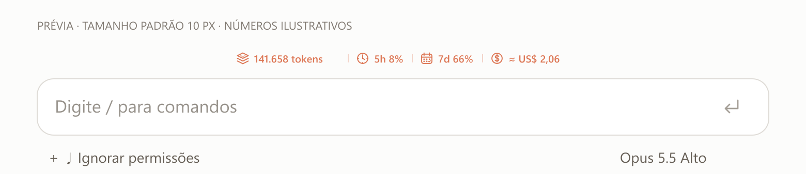

# Kadenai's Style

**v0.3.1 · Claude Code Desktop**

Uma linha pequena e centralizada acima da caixa de mensagem com quatro ícones SVG na cor **#dd7654**: tokens utilizados no contexto, cota de 5 horas, cota semanal e custo equivalente de API. Os dados aparecem automaticamente, com fonte sans-serif mais marcada e fundo integrado ao tema.



| Indicador | O que mostra |
| --- | --- |
| Camadas / tokens | Tokens utilizados na janela de contexto atual, conforme a última resposta |
| Relógio / 5h | Percentual usado da cota de 5 horas da conta |
| Calendário / 7d | Percentual usado da cota semanal da conta |
| Moeda / US$ | Quanto a conversa teria custado pela API, em dólares |

**“—” significa dado indisponível**, não consumo zero. `≈` indica custo estimado; `*` indica uma estimativa parcial. Valores positivos abaixo de um centavo aparecem como `<0,01`.

## Configurar

Na aba **Plugins** das configurações do Claude, abra **Kadenai's Style**. Há quatro controles independentes, todos ligados por padrão:

- Mostrar contexto
- Mostrar limite da sessão
- Mostrar limite semanal
- Mostrar custo equivalente de API

O campo **Tamanho da faixa (px)** aceita de **8 a 20 pixels**, com padrão **10**. Texto, ícones e espaço entre os dados acompanham esse tamanho. No padrão, o desenho ocupa **18 px de altura** e apenas a largura necessária aos valores. A faixa fica centralizada e cobre a moldura cinza nativa com a cor de fundo da conversa, acompanhando os temas claro e escuro. Em uma coluna estreita, os indicadores podem passar para a linha seguinte para manter os valores legíveis.

A fonte usa peso 600, sem esticar artificialmente as letras. A lista de fontes prefere **Anthropic Sans**, quando disponível ao SVG, seguida de **Segoe UI Variable**, **Segoe UI** e Arial. O plugin não distribui arquivos de fontes.

Esses campos são nativos de `userConfig`: o Claude desenha e salva os controles. Também aparecem em `/config` no terminal. O módulo recebe os valores em `register(on, options)` e recarrega quando a configuração muda. O tamanho em pixels se aplica ao SVG no Desktop; o terminal usa sua própria fonte.

O mod não adiciona botões, painel próprio, comandos, recentes ou iniciador de chat sem projeto.

## Instalar ou atualizar

Para a primeira instalação:

```powershell
claude plugin marketplace add Kadenai/kadenais-style
claude plugin install kadenais-style@kadenais-style --scope user
```

Se já instalou:

```powershell
claude plugin marketplace update kadenais-style
claude plugin update kadenais-style@kadenais-style
```

Depois, execute `/reload-plugins`, quando disponível, ou abra uma nova conversa local na aba Code. A conversa precisa recarregar o plugin para deixar de usar a versão anterior. Mantenha o Claude Code e o aplicativo Claude Desktop atualizados.

Para desenvolvimento:

```powershell
git clone https://github.com/Kadenai/kadenais-style.git
claude --plugin-dir ./kadenais-style
```

## Como os dados funcionam

As medições atualizam em `session.measure` e ao concluir respostas. As cotas podem ficar indisponíveis até o Claude informar os valores; contas com chave de API podem não ter cotas de assinatura.

A cota de sessão corresponde à janela de 5 horas **da conta**. O contexto mostra `context.tokens`, incluindo entrada normal e tokens de cache. É a janela atual, com o efeito da compactação; não é a soma de todos os tokens da conversa. Não calculamos tokens a partir do percentual arredondado.

A interface usa `AbovePrompt`. No Desktop, um SVG reúne texto e ícones, permitindo ajustar o tamanho do conjunto. No terminal, a mesma faixa usa texto. O mod preserva o conteúdo dos mods que vêm depois dele e cede a faixa aos controles nativos quando `hasSurvey` está ativo. Um mod anterior que substitua toda a faixa pode impedir a exibição.

O ponto anterior, `SessionMode`, filtra SVGs no Desktop analisado e limita o texto a `24ch`. A versão 0.3.0 usa a faixa acima da caixa para oferecer os ícones e mais espaço, sem duplicar os indicadores no rodapé.

## Custo equivalente de API

1. Quando existe, usamos `$.session.usage().cost.usd`, o total calculado pelo Claude Code para a conversa, incluindo histórico e modalidades que o mecanismo contabiliza.
2. Sem esse total, somamos os tokens de cada resposta em `turn.step`, com o modelo efetivo e a tabela oficial. Incluímos subagentes e evitamos duplicar respostas.
3. Contabilizamos separadamente entrada, saída, gravação de cache e leitura de cache. A contabilidade de reserva fica no armazenamento local do plugin para retomadas.

Tabela conferida em **2026-10-03**: [preços oficiais da Anthropic](https://platform.claude.com/docs/en/about-claude/pricing). Os valores por milhão de tokens estão em [hooks/prices.js](hooks/prices.js).

A tabela de reserva usa API padrão, roteamento global e cache de 5 minutos, pois os eventos não informam o TTL por resposta. Não inclui Fast mode, ferramentas pagas no servidor, impostos, descontos negociados ou tarifas de terceiros. Quando o mecanismo informa seu próprio total, preferimos esse total.

Histórico anterior à ativação, modelos sem preço cadastrado e respostas sem contagem tornam a estimativa de reserva **parcial**. Modelos desconhecidos não recebem preços inventados. **O indicador simula um custo de API; não representa cobrança adicional da assinatura.** A tabela é distribuída com o plugin, sem baixar preços em segundo plano.

## Verificação e compatibilidade

```powershell
claude plugin validate .claude-plugin/plugin.json --strict
claude plugin validate .claude-plugin/marketplace.json --strict
claude plugin test .
```

**18 testes locais passaram** no Claude Code 2.1.288 e no motor 2.1.286 do Desktop 2.19675.0.0. Usam o kit oficial `claude-code/testing` e cobrem o SVG no ponto correto, ausência de botões, as 16 combinações de controles, tokens reais, dados indisponíveis, tamanho ajustável, quebra de linha, convivência com outros mods, prioridade dos controles nativos, streaming, subagentes, retomada e preços.

A prévia é gerada com os mesmos SVGs e o mesmo código de desenho usado pelo mod. Uma verificação adicional em navegador sem interface reproduziu a moldura nativa e executou o normalizador e o gerador de estilos do Desktop analisado: a faixa permaneceu centralizada e cobriu o cinza nos dois temas, com tamanhos 8, 10 e 20 e em uma coluna estreita. Essas verificações não substituem uma conferência visual na conversa aberta.

A moldura do Desktop reserva uma altura mínima de 40 px antes do zoom do aplicativo; diminuir o tamanho reduz os indicadores dentro desse espaço. A cobertura usa somente propriedades nativas de `Box` e a cor `memoryBackgroundColor`, que o Desktop mapeia para a superfície da conversa. Essa moldura pode mudar em versões futuras. A interface requer uma sessão com renderização; não há garantia de exibição no SDK, na nuvem ou em WSL.

## Mudanças em 0.3.1

- Fonte sans-serif com peso 600 e proporções naturais.
- Faixa centralizada acima da caixa de mensagem.
- Moldura cinza coberta pela cor do tema, no claro e no escuro.
- Campo de tamanho renomeado para **Tamanho da faixa (px)**, mantendo 8 a 20 px e padrão 10 px.

## Mudanças em 0.3.0

- Indicadores movidos para uma faixa pequena acima da caixa de mensagem.
- Quatro SVGs próprios em `#dd7654`, com espaço entre os dados.
- Contexto alterado de percentual para tokens utilizados.
- Tamanho ajustável de 8 a 20 px, com padrão 10 px.
- Preservação do conteúdo dos mods seguintes na faixa compartilhada.

## Versões anteriores

Na 0.2.1, os indicadores passaram a retornar texto explícito para corrigir o rodapé vazio. Na 0.2.0, a configuração foi movida para os campos nativos e foram removidos os botões, painéis, recentes e iniciador de conversas.

## Privacidade

O código não faz requisições HTTP, não lê credenciais, não inicia processos e não registra títulos, mensagens ou caminhos das conversas. Lê apenas os quatro ícones SVG que acompanha e guarda a contabilidade de custos por identificador de sessão no store local. As configurações são salvas pelo próprio Claude.

## Referências

- [Anúncio dos mods](https://claude.com/blog/claude-code-mods)
- [Mods oficiais](https://github.com/anthropics/claude-code/tree/main/mods)
- [Interface dos mods](https://code.claude.com/docs/en/plugins/mods/interface)
- [Configuração nativa de plugins](https://code.claude.com/docs/en/plugins/manifest-reference#user-configuration)
- [Testes de mods](https://code.claude.com/docs/en/plugins/mods/test)

Licença MIT.
